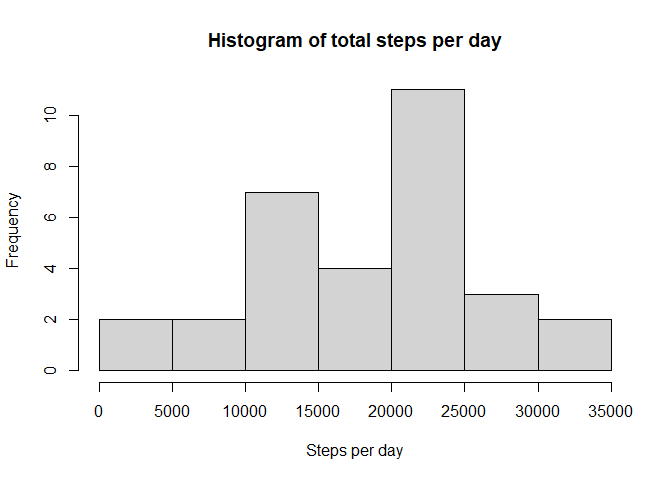
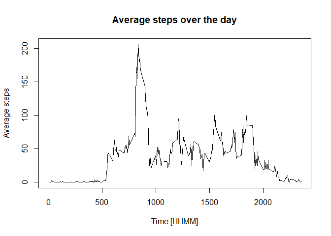
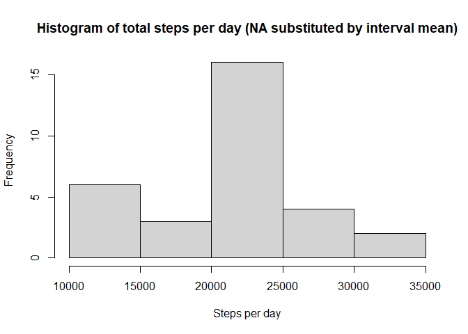
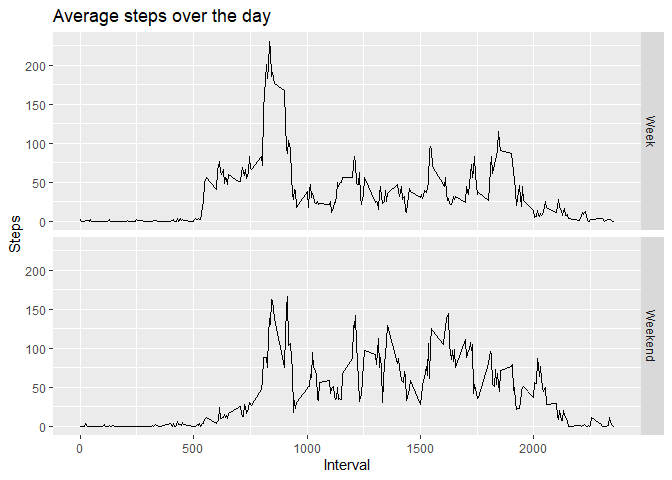

## Loading and preprocessing the data

```r
#setwd("C:/Pavel/DataScience/Reproducible_research/W2_assignment/RepData_PeerAssesment1")

#download.file("https://d396qusza40orc.cloudfront.net/repdata%2Fdata%2Factivity.zip", destfile = "repdata%2Fdata%2Factivity.zip")

rawdata <- read.csv(unzip("repdata%2Fdata%2Factivity.zip"))
rawdata$date <- as.Date(rawdata$date)

#Also, let's load the packages we are using later.
library(lubridate)
```

```
## Warning: package 'lubridate' was built under R version 4.2.2
```

```
## Loading required package: timechange
```

```
## Warning: package 'timechange' was built under R version 4.2.2
```

```
## 
## Attaching package: 'lubridate'
```

```
## The following objects are masked from 'package:base':
## 
##     date, intersect, setdiff, union
```

```r
library(dplyr)
```

```
## Warning: package 'dplyr' was built under R version 4.2.2
```

```
## 
## Attaching package: 'dplyr'
```

```
## The following objects are masked from 'package:stats':
## 
##     filter, lag
```

```
## The following objects are masked from 'package:base':
## 
##     intersect, setdiff, setequal, union
```

```r
library(ggplot2)
```

```
## Warning: package 'ggplot2' was built under R version 4.2.2
```


## What is mean total number of steps taken per day?
We will first add the day as a new column and then group and summarize the data by the new column "day". 


```r
steps_per_day <- rawdata %>% mutate(day = day(date)) %>% group_by(day) %>% summarize(totalsteps = sum(steps, na.rm = TRUE))
```

Now we have the data ready to be plotted


```r
hist(steps_per_day$totalsteps, xlab = "Steps per day", main = "Histogram of total steps per day")
```

<!-- -->

And the median and mean are simply called by the native functions:


```r
median(steps_per_day$totalsteps)
```

```
## [1] 20525
```

```r
mean(steps_per_day$totalsteps)
```

```
## [1] 18406.71
```


## What is the average daily activity pattern?

First, we make a new dataframe where we group the data by interval and make an average value.


```r
steps_in_interval <- rawdata %>% group_by(interval) %>% summarize(meansteps = mean(steps, na.rm = TRUE))
```

Now we just plot the mean number of steps in each interval.

```r
plot (steps_in_interval$interval, steps_in_interval$meansteps, type = "l", xlab = "Time [HHMM]", ylab = "Average steps", main = "Average steps over the day")
```

<!-- -->

To look at the interval, in which the maximum number of steps is done, let's check the max meanstep value and call the corresponding interval from column 1.

```r
steps_in_interval[steps_in_interval$meansteps == max(steps_in_interval$meansteps),1]
```

```
## # A tibble: 1 × 1
##   interval
##      <int>
## 1      835
```

The maximum steps are obviously done in the interval between 8:35-8:40AM.

## Imputing missing values
First, we calculate and report the total number of missing values in the dataset (i.e. the total number of rows with NA:


```r
#Calculate and report the total number of missing values in the dataset (i.e. the total number of rows with NA

sum(is.na(rawdata$steps))
```

```
## [1] 2304
```

So, there are 2304 missing values.

To input the missing values, we will use the average steps the given (missing) interval from the monthly average.
First, we will merge the original data with the mean step value generated previously and stored in steps_in_interval dataframe.


```r
#Merging the data with average steps in given interval
data_filled <- merge(rawdata,steps_in_interval,by = "interval")
```

Now, we substitute the NA by the mean interval value:


```r
data_filled$steps[is.na(data_filled$steps)] <- 
    data_filled$meansteps[is.na(data_filled$steps)]
```

To make the new data look exactly the same as the original, we must sort by date and intervalal order, remove the filler column (meansteps) and reorder the columns to be the same as in original dataset:

```r
data_filled <- data_filled[order(data_filled$date, data_filled$interval),]
data_filled <- data_filled[,!names(data_filled) == "meansteps"]
data_filled <- data_filled[,c(2,3,1)]
head(data_filled)
```

```
##         steps       date interval
## 1   1.7169811 2012-10-01        0
## 63  0.3396226 2012-10-01        5
## 128 0.1320755 2012-10-01       10
## 205 0.1509434 2012-10-01       15
## 264 0.0754717 2012-10-01       20
## 327 2.0943396 2012-10-01       25
```

Now, we just generating the new dataframes with the filled-in data and make the same plots, mean and median as in the previous task.

```r
steps_per_day_f <- data_filled %>% mutate(day = day(date)) %>% group_by(day) %>% summarize(totalsteps = sum(steps, na.rm = TRUE))

#Getting plot and statistics output
hist(steps_per_day_f$totalsteps, xlab = "Steps per day", main = "Histogram of total steps per day (NA substituted by interval mean)")
```

<!-- -->

```r
median(steps_per_day_f$totalsteps)
```

```
## [1] 21641
```

```r
mean(steps_per_day_f$totalsteps)
```

```
## [1] 21185.08
```
The median is 21641 and the mean 21185.08. 

So to summarize the observations, filling in the NA values by the mean for the given interval generally increases the average steps in the previously missing intervals. Also, it mildly increases the mean and median number of steps per month. I think it is not a good idea to substitute the missing values.

## Are there differences in activity patterns between weekdays and weekends?
First, we generate a new datacolumn with the day name and then another column with the factor Week or Weekend.

```r
fill_categh <- data_filled %>% mutate(weekday = weekdays(date))
fill_categh$WE[fill_categh$weekday %in% c("Saturday","Sunday")] <-  "Weekend"
fill_categh$WE[fill_categh$weekday %in% 
                   c("Monday", "Tuesday", "Wednesday", "Thursday", "Friday")] <-  "Week"
```

Now, we can just group and summarize the data.

```r
steps_int_fill <- fill_categh %>% group_by(interval,WE) %>% summarize(meansteps = mean(steps, na.rm = TRUE))
```

```
## `summarise()` has grouped output by 'interval'. You can override using the
## `.groups` argument.
```

In the last task, we just plot the grouped data separated by Week or Weekend value.

```r
qplot(interval, meansteps, data = steps_int_fill, na.rm = TRUE,
      facets = as.factor(WE) ~ ., geom = ("line"),
      xlab = "Interval", ylab = "Steps", 
      main = "Average steps over the day")
```

```
## Warning: `qplot()` was deprecated in ggplot2 3.4.0.
```

<!-- -->

So there are some differences, e.g people generally starting to wal earlier during the Week, or having more spread pattern during the Weekend. But actually, I expected a bigger difference between the Week and the Weekend.

